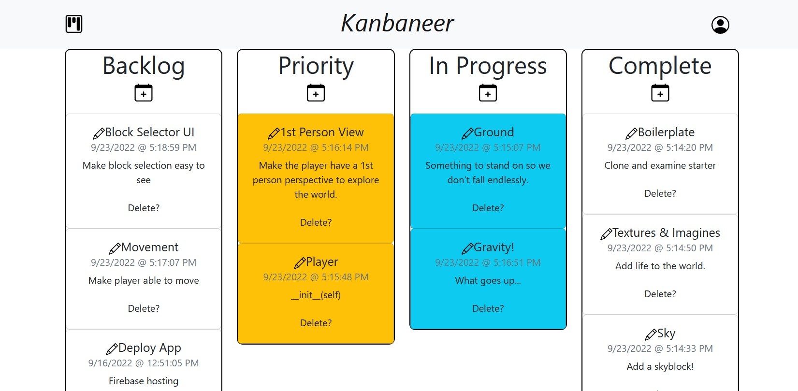

# React Kanban Board
Live at: https://www.kanbaneer.com/

## How I Worked
- Utilized branches and PRs to cleanly make progress on [different tasks](https://github.com/ObiBaratt/kanban-board/pull/4) or to [fix bugs](https://github.com/ObiBaratt/kanban-board/pull/6) that I couldn't allocate time to when they were discovered.
- Imported handy modules, but spent time figuring out how things worked behind the scenes in micro side projects. A notable example was figuring out the HTML Drag and Drop API before using React-DnD in the main project.

## Why I Made Certain Choices
- **React** v.s. Next and **JavaScript** v.s. TypeScript: While working on this project I was also working at an internship with Amotions Inc where I used Next with TypeScript. I chose to use React and JavaScript here to stay familiar with the basics and to have up to date experience with both.
- **Bootstrap CSS**: I added Bootstrap to get some easy to apply CSS classes to have decent styling quickly. In the end I utilized a very minimal amount and it will be **removed** in a future update.
- **Component Based Styling**: I knew from the beginning that I wanted each component to have its own styling to take advantage of the modularity of React Components. The clean organization and styling specificity of this approach really appeals to me. Constraining myself to a basic structure led to **freedom** to focus on the [*actual code*](https://github.com/ObiBaratt/kanban-board/tree/main/src/components).
- **No Mobile Support**: At the start I intended to make a mobile version where each column was under nav tabs, and you could switch between them, but made a subjective decision that a Kanban Board is *not* useful to access on a phone.
- **Google Cloud**: I've used PostgreSQL with Flask and Express backends in the past, but really wanted to explore Google Cloud functionality to help solidify what I learned working with it at my internship.

## Design Upgrade!

## from \_\_future\_\_ import *good_ideas*:
- ~~Have the Edit Card functionality pre-fill edit fields with current values. Nice QoL update.~~ Current: Edits persist until refresh. I think this is better than edits resetting when the edit interface is toggled again.
- Utilize state management (Redux / Thunk). This would make handling auth state a lot easier. Should be an enjoyable Friday night refactoring...?
- Setup CI/CD. I didn't implement this before due to doing everything locally. Now that its deployed this is a priority.
- Add testing: This is connected to the above, but having baseline tests to make sure a new change doesn't break anything would be a huge improvement.
- Minimalistic mobile version: A full Kanban Board isn't useful, but a clean "zen" mode where it just has your Work-In-Progress cards displayed (potentially with an option to add a WIP if there isn't one via dropdown) could be useful if the board is being utilized for a non-tech project (or as the open window in your phone so when you get distracted and pick it up to waste time you get sent back to work).
- General cleanup. I was so happy to be able to deploy this that I left some legacy code, unused functions, and commented out code that could do with some tidying.
